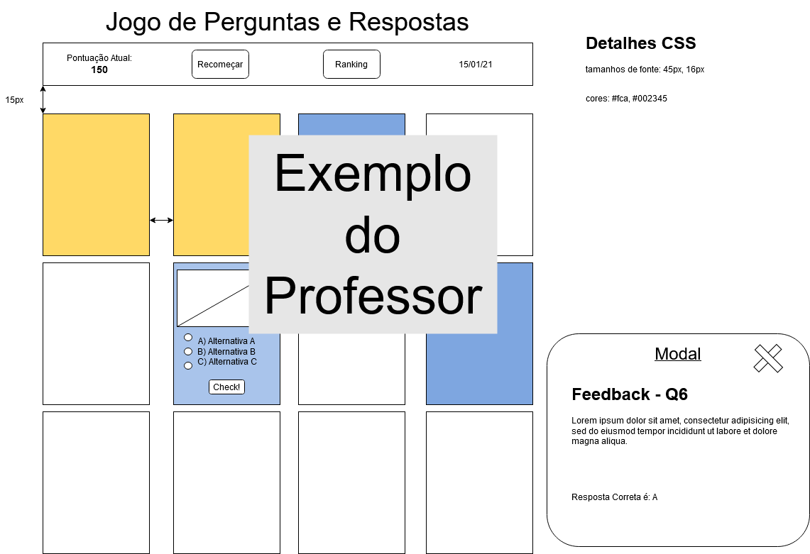

# Projeto Quiz LIMA
Trabalho individual de LIMA, para fechamento do primeiro semestre do curso de desenvolvimento de sistemas do SENAI

## Wireframe
O Wireframe deste projeto considera não apenas computadores pessoais, mas também dispositivos móveis, veja abaixo a imagem do Wireframe

## Leia o Manual do Jogo (Screenshots)
Veja algumas capturas de tela, e explore os recursos.

### Recursos
- [IMG] Pontuação
- [IMG] Ranking
- [IMG] Feedback Individual
- ...
